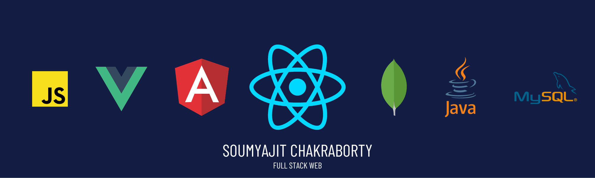

  

  

###

  
  

###

<h1 align="center">Hi 👋, I'm Soumyajit Chakraborty</h1>

###

<h3 align="left">👩‍💻  About Me</h3>

###

I'm ... from India   - 🔭 I’m working as Full-stack Developer - 📚 I'm currently learning Design Patterns and MERN - ⚡ In my free time I click pictures

###

<h3 align="left">🛠 Language and tools</h3>

###

  
  
  
  
  
  
  
  
  
  
  
  
  
  
  
  
  
  
  
  
  
  
  

###

<h3 align="left">🛠 IDE I prefer</h3>

###

  
  
  
  
  

###
